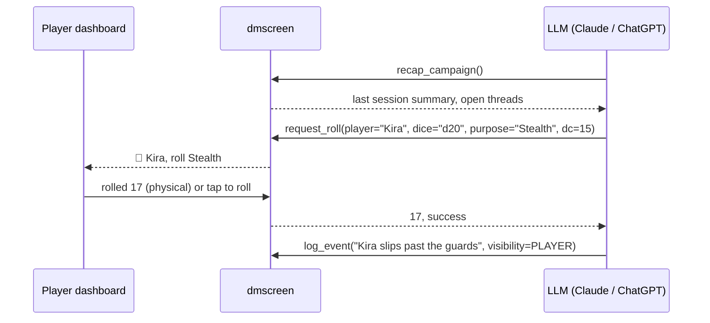

<h1 align="center">🐉 dmscreen</h1>

<p align="center">
  <strong>The screen behind the Dungeon Master.</strong><br>
  An MCP server that gives an LLM everything it needs to run a D&amp;D 5e table: honest dice, campaign state, rules, and secrets the players can't see.
</p>

<p align="center">
  <a href="https://github.com/uyqn/dmscreen/actions/workflows/build.yml"></a>
  <a href="https://codecov.io/gh/uyqn/dmscreen"></a>
</p>

<p align="center">
  
  
  
  
</p>
<p align="center">
  
  
  
  
  
</p>

---

## What it is

Claude or ChatGPT narrates. **dmscreen** remembers.

An LLM is a brilliant improviser and a terrible bookkeeper. It forgets hit points, invents dice results, and can't keep a secret from the players because everything it knows is in the same conversation. dmscreen fixes that by moving the bookkeeping out of the model and into a server the model talks to through the [Model Context Protocol](https://modelcontextprotocol.io):

| The LLM does | dmscreen does |
|---|---|
| Narrates scenes, voices NPCs, adjudicates rules | Owns characters, HP, conditions, inventory and XP |
| Decides *what* a roll means | Rolls the dice, or waits for the player to roll real ones |
| Asks for rules when unsure | Serves the SRD 5.2.1 rules, spells, monsters and conditions |
| Runs the story | Keeps the event log, journal and session recaps |
| Sees everything | Marks what is player-visible and what is DM-only |

The server never writes prose. It is a state machine with dice.

## How a session works



The `request_roll` call blocks until the player rolls, so the LLM gets the result in the same tool call. Nobody has to say "I rolled a 17". In voice mode, nobody has to look at a screen.

## Architecture

A [Spring Modulith](https://spring.io/projects/spring-modulith) application. One schema per module, IDs across module boundaries, events between them. Each module is already service-shaped, so extracting one later is a deployment change, not a rewrite.

```
no.uyqn.dmscreen
├── account     accounts and OAuth links                (later)
├── character   the sheet: class, abilities, inventory, spells
├── campaign    party, NPCs, journal, live HP and resources
├── session     sessions, encounters, initiative, roll requests, event log
├── rules       SRD 5.2.1 content: full-text search, spells, monsters, conditions
├── dice        honest dice with an audit trail
├── mcp         MCP tools, prompts and server instructions   (adapter)
└── web         REST and SSE for the player dashboard        (adapter)
```

Module boundaries are verified in the test suite with `ApplicationModules.verify()`. A module that reaches into another module's internals fails the build.

## Getting started

Prerequisites: a JDK 25, Docker (Colima, Docker Desktop or similar).

```bash
git clone <this repo> && cd dmscreen
colima start                 # or start Docker Desktop
./gradlew bootRun            # starts Postgres via Docker Compose, then the server
```

The MCP endpoint is `http://localhost:8080/mcp`. Connect a client:

```bash
# Claude Code
claude mcp add --transport http dmscreen http://localhost:8080/mcp
```

Run the tests:

```bash
./gradlew test
```

Full setup notes, including JDK, Docker and IDE choices, are in
[docs/development.md](docs/development.md).

## Roadmap

- [x] Project skeleton: Spring Boot 4.1, Spring AI MCP server, Modulith, Postgres
- [ ] `dice` and `roll_dice`, first tool end to end through Claude
- [ ] `character` and `campaign`: sheets, party, HP, conditions, resources
- [ ] `session`: encounters, initiative, event log, recaps
- [ ] `request_roll` with the blocking player flow
- [ ] `rules`: SRD 5.2.1 import, full-text search, structured lookups
- [ ] Voice-mode dry run through a tunnel
- [ ] Player dashboard (`web`)
- [ ] Rules as RAG with pgvector
- [ ] OAuth 2.1 resource server, deploy to AWS, connect from Claude.ai
- [ ] Externalize the session event stream to Kafka

## Licence and attribution

Code is licensed under the [MIT License](LICENSE).

This work includes material from the System Reference Document 5.2.1 ("SRD 5.2.1") by Wizards of the Coast LLC, available at https://www.dndbeyond.com/srd. The SRD 5.2.1 is licensed under the Creative Commons Attribution 4.0 International License, available at https://creativecommons.org/licenses/by/4.0/legalcode.

Dungeons &amp; Dragons is a trademark of Wizards of the Coast LLC. This project is not affiliated with or endorsed by Wizards of the Coast.
